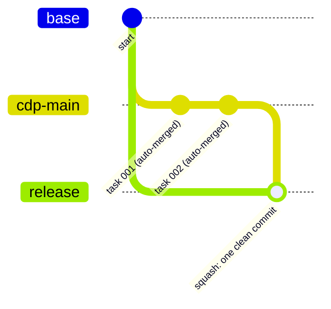

# Branching

CDP has its own git branch naming and merge conventions, designed so a
spec's work stays isolated until it's ready, while still landing in a
predictable place. All CDP-created branches are `cdp/`-prefixed, so they're
identifiable at a glance in a repo that also has other branches.

## Branch naming

| Type | Pattern | When it's used |
|---|---|---|
| Spec main | `cdp/specs/<spec_number>/main` | Persistent integration branch for a spec - created from the spec's base branch the first time any task branch is created for it |
| Spec task | `cdp/specs/<spec_number>/tasks/<task_number>` | Normal implementation work - branches from the spec's `main` branch |
| Bug fix | `cdp/specs/<spec_number>/fix/<short-description>` | The spec itself was correct; the implementation wasn't |
| Spec amendment | `cdp/specs/<spec_number>/amend/<short-description>` | The spec's own requirements changed; this implements the delta |
| One-off task | `cdp/tasks/<task_number>/dev` | Work not tied to any spec |
| Ad-hoc change | `cdp/adhoc/<short-description>` | A quick, well-understood change that still needs its own branch |

`<spec_number>` / `<task_number>` are the bare numeric prefix only (e.g.
`005`), not the full folder name.

## How spec branches merge

This is the part that differs from a lot of manual git workflows: **spec
task branches merge themselves.** When a task completes, its branch merges
into `cdp/specs/<spec_number>/main` automatically, with no separate review
step required for that merge - the branch is then deleted. Bug-fix and
amendment branches for the same spec follow the same auto-merge pattern.

```mermaid
gitGraph
    commit id: "base branch"
    branch main
    checkout main
    branch tasks/001
    checkout tasks/001
    commit id: "task 001 work"
    checkout main
    merge tasks/001 id: "auto-merge, branch deleted"
    branch tasks/002
    checkout tasks/002
    commit id: "task 002 work"
    checkout main
    merge tasks/002 id: "auto-merge, branch deleted"
```

`main` here is `cdp/specs/<spec_number>/main`; `tasks/001`/`tasks/002` are
`cdp/specs/<spec_number>/tasks/001` etc. Each task branch merges back into
`main` the moment it's done - no leftover branches, no separate review step
for that merge.

**One-off tasks work differently.** A one-off task branch
(`cdp/tasks/<n>/dev`) is not auto-merged - since there's no persistent
"main" integration branch for one-off work the way there is for a spec, that
merge stays a deliberate, human-reviewed step.

## Before any branch is created

CDP runs a safety check first: it resolves which branch new work should
start from (recorded once, in that spec's or task's `session.md`, and reused
from then on), and checks for any sibling branch that hasn't been merged yet.
For spec tasks this is a quiet backstop - the normal flow never leaves
something unmerged, so it only produces a warning in an abnormal case, like
an abandoned task. For one-off tasks it's an interactive check: if unmerged
work is found, you're asked whether to branch from it, branch anyway, or
stop so it can be merged first.

## Moving work toward a release

Separately from a spec's own completion status, work can be moved into a
release/testing pipeline at any point via a **release squash**: a
`cdp/specs/<n>/release` (or `cdp/tasks/<n>/release`) branch is created from
the spec's or task's original base branch, and every commit from the source
branch is squashed into it as one well-described commit. This keeps the
detailed task-by-task history on the working branch while giving the release
pipeline one clean commit to work with. The source branch is only deleted
after explicit confirmation, since squashing can't be undone from the
release branch alone.



The easy-to-miss detail this diagram makes obvious: `release` branches from
**`base`**, not from `cdp-main`'s own tip. Branching `release` from
`cdp-main` instead would make the squash a no-op, since the two branches
would already be identical at that point - there'd be nothing to collapse.
